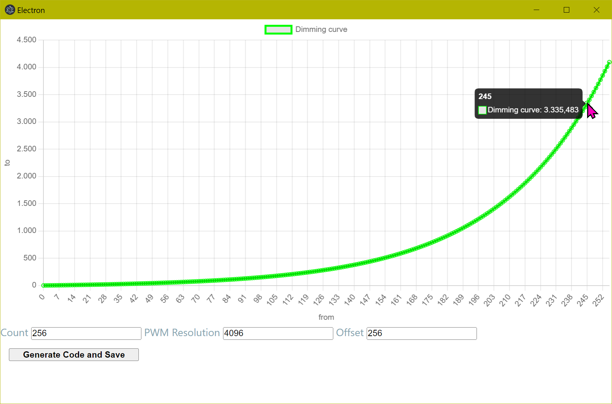

# dimming-curve-generator

Application to generate dimming curves for lights



## Project Setup

You need NodeJs, available in your path

### Install

```bash
$ npm install
```

### Development

```bash
$ npm run dev
```

### Build

```bash
# For windows
$ npm run build:win

# For macOS
$ npm run build:mac

# For Linux
$ npm run build:linux
```
